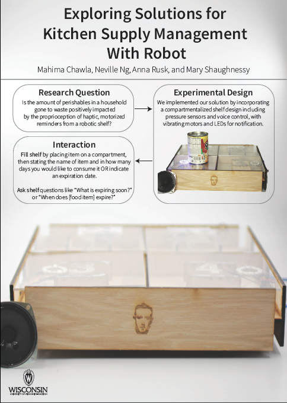

# Robotic Shelf - ZUCK

Robotic shelf created for UW - Madison Human-Computer Interaction UX class (CS639) using a Google AIY kit (Raspberry Pi and Google Cloud's Speech-to-Text API) and also an Arduino to receive inputs from the AIY kit and to control the motors and lights on the robotic shelf. 

# Purpose of Research

An inventory management system created to solve the issue of inventory mismanagement in homes, and indexing grocery items according the date the purchaser will be pleased to use them by as an attempt to mitigate **food wastage**.

# Technology

- 4 Pressure Sensors
- 4 NeoPixel LED rings
- 4 Vibrating Motor
- Basic Arduino Kit
- 1 Google Assemble-It-Yourself Voice Kit
   * Raspberry Pi Zero WH
   * Speaker
   * Voice bonnet
   * + All required connectors
   
# Final Product 
Check out our final research findings [here](https://drive.google.com/a/wisc.edu/file/d/1MVOnkKX0NuTHAalpuPVDb1lPEz1rCKUM/view?usp=sharing) completed with pictures!

# Acknowledgements 

We would like to thank our principal investigator, Bilge

Mutlu for helping us through every step of the way in ev-
ery procedure and protocol required for this study to be

possible. We would also like to thank the UW Computer
Science Department for funding the development of this
robot. We appreciate the UW Makerspace's resources and

student faculty for helping us undersand machinery and cir-
cuit elements. Finally, we would like to thank all the research
participants that participated in this study.
